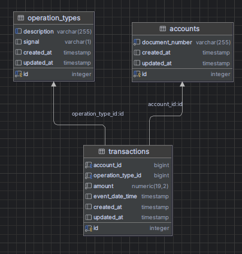

# Documentação do Sistema Bancário

## Visão Geral
Este é um sistema bancário que gerencia contas e transações financeiras. O sistema foi construído usando Spring Boot e segue um padrão de arquitetura em camadas.

## Rodando o projeto
 - Basta rodar o comando 
  ````shell
     make run-local
````


## Componentes Principais

### 1. Gerenciamento de Contas

#### Controlador de Conta (`AccountController.java`)
- **Caminho Base**: `/v1/accounts`
- **Endpoints**:
    - `GET /{accountId}`: Recupera informações da conta
    - `GET /health`: Endpoint de verificação de saúde
    - `POST /`: Cria nova conta
- **Formato de Resposta**: Retorna respostas em string com códigos de status HTTP apropriados

#### Serviço de Conta (`AccountService.java`)
- Gerencia a lógica de negócio para operações de conta
- Funcionalidades principais:
    - Criação de conta
    - Recuperação de conta
    - Prevenção de contas duplicadas
- Lança exceções específicas para casos de erro

### 2. Gerenciamento de Transações

#### Serviço de Transação (`TransactionService.java`)
- Funcionalidades principais:
    - Criação de transação
    - Recuperação de transação
    - Prevenção de transações duplicadas
    - Validação de valores
    - Validação de tipo de operação

Características principais:
- Detecção de transações duplicadas em janela de 1 minuto
- Validação de escala de valores (2 casas decimais)
- Validação de sinal do tipo de operação (valores positivos/negativos)

### 3. Modelos de Domínio

#### Conta (`Account.java`)
- Propriedades:
    - `id` (Long): Identificador gerado automaticamente
    - `documentNumber` (String): Identificador único do documento

#### Tipo de Operação (`OperationType.java`)
- Propriedades:
    - `id` (Long): Identificador gerado automaticamente
    - `description` (String): Descrição da operação
    - `signal` (String): Sinal da operação (+/-)

## Modelagem do banco de dados


## Tratamento de Erros

O sistema inclui tratamento abrangente de erros para vários cenários:
- Conta não encontrada
- Conta já existente
- Transação não encontrada
- Transação já existente
- Escala de valor inválida
- Incompatibilidade entre valor e tipo de operação

## Detalhes Técnicos

### Armazenamento de Dados
- Utiliza JPA/Hibernate para persistência
- Relacionamentos entre entidades:
    - Um-para-Muitos entre Conta e Transações
    - Muitos-para-Um entre Transação e TipoOperação

### Registro de Requisições
- Configurado através do `TransactionControllerConfig`
- Registra:
    - Strings de consulta
    - Payloads de requisição (até 10000 caracteres)
    - Cabeçalhos
    - Dados da requisição com prefixo "REQUEST DATA : "

### Considerações de Segurança
- Validação de entrada na camada de serviço
- Validação de valor de transação
- Prevenção de transações duplicadas
- Garantia de unicidade do número do documento

## Records da API

### AccountCreationRecord
- Usado para criar novas contas
- Campos:
    - `documentNumber`: Identificador único para a conta

### AccountRecord
- Usado para respostas de conta
- Campos:
    - `id`: Identificador da conta
    - `documentNumber`: Número do documento da conta

### TransactionCreationRecord
- Usado para criar novas transações
- Campos:
    - `account_id`: ID da conta associada
    - `operation_type_id`: Tipo de operação
    - `amount`: Valor da transação

### TransactionRecord
- Usado para respostas de transação
- Campos:
    - `id`: Identificador da transação
    - `accountId`: Conta associada
    - `amount`: Valor da transação
    - `eventDate`: Data/hora da transação
    - `operationTypeId`: Tipo de operação

## Implementação de Boas Práticas
1. Separação de responsabilidades arquiteturais em camadas
2. Injeção de dependência para baixo acoplamento
3. Tratamento de exceções com tipos específicos
4. Padrão Builder para criação de records
5. Padrão Repository para acesso a dados
6. Records imutáveis para transferência de dados
7. Logging para rastreamento de requisições
8. Validação de entrada e aplicação de regras de negócio

## Requisitos de Configuração e Instalação
1. Configuração de banco de dados (JPA/Hibernate)
2. Configuração de logging
3. Propriedades da aplicação Spring Boot
4. Dependências necessárias:
    - Spring Boot
    - Spring Data JPA
    - Lombok
    - Jakarta Persistence
5. Docker para rodar o projeto

## Testes
O sistema inclui testes unitários cobrindo:
- Criação e recuperação de contas
- Processamento de transações
- Cenários de erro
- Validação de regras de negócio